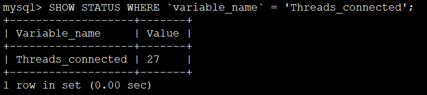
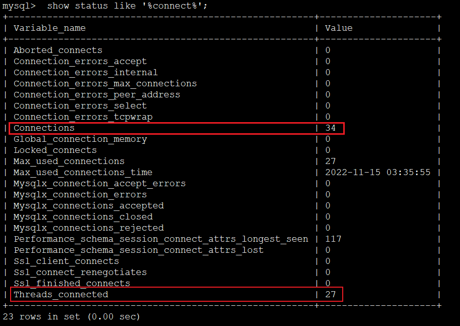

# 连接数

## 查看当前连接数

```
SHOW STATUS WHERE `variable_name` = 'Threads_connected';
```






```
Connections:  总计视图连接MySQL的数量

The number of connection attempts (successful or not) to the MySQL server.

Threads_connected: 当前开启的连接数

The number of currently open connections.:
```


```
show status like '%connect%';
```


---
